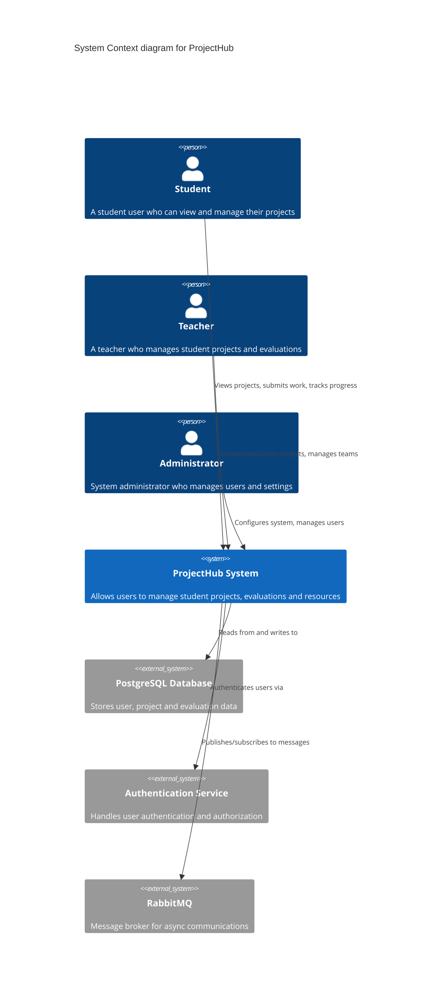
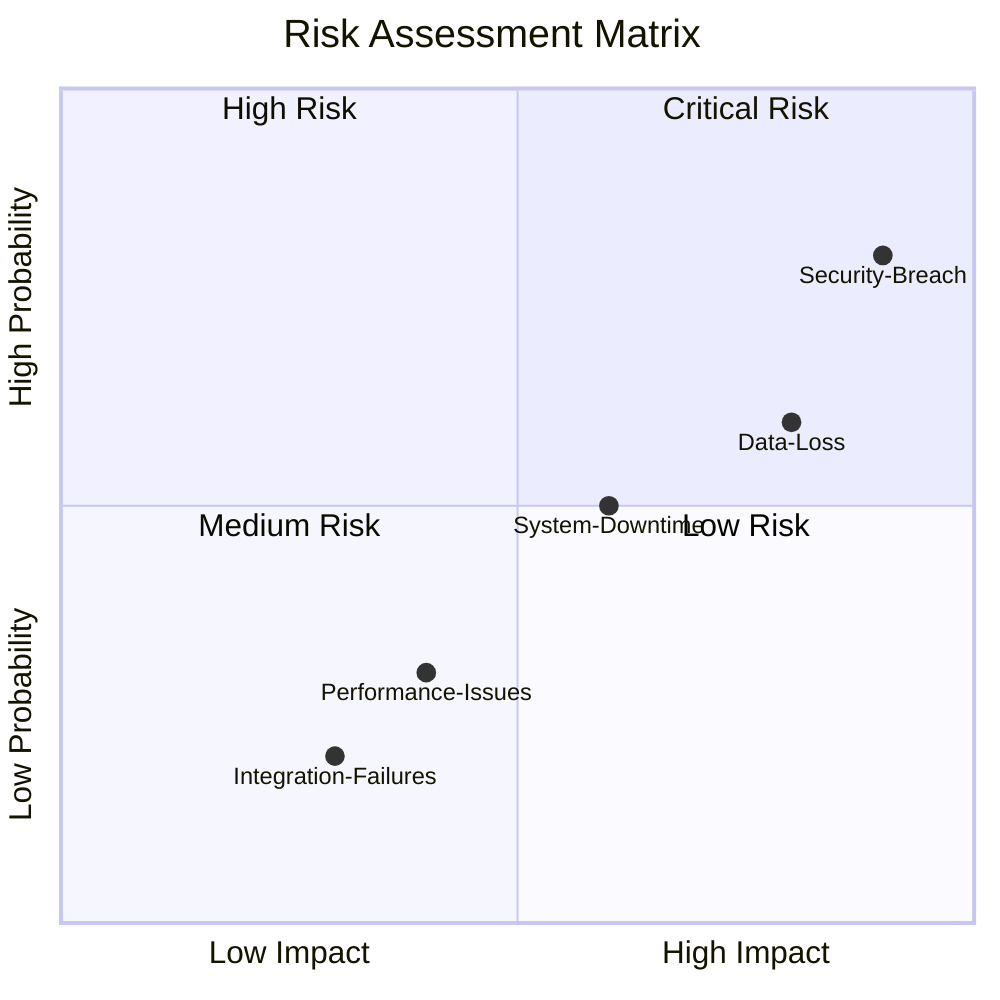

# Architecture Overview

## System Architecture

The architecture of the ProjectHub system is designed to support a robust and scalable platform for managing educational projects. The system is built using a microservices architecture, which allows for independent deployment and scaling of different components.

### Key Components

1. **User Management Service**: Handles user registration, authentication, and role-based access control.
2. **Project Management Service**: Manages project creation, updates, and tracking of project statuses.
3. **Task Management Service**: Facilitates the creation, assignment, and tracking of tasks associated with projects.
4. **Resource Management Service**: Oversees the allocation and management of resources required for projects.
5. **Notification Service**: Sends notifications to users regarding project updates, task assignments, and deadlines.

### Technology Stack

- **Frontend**: JavaFX for building the user interface.
- **Backend**: Spring Boot for developing microservices.
- **Database**: PostgreSQL for data storage and management.
- **Messaging**: RabbitMQ for inter-service communication.

## Diagrams

### System Context Diagram

### Risk Matrix Diagram

## Conclusion

The architecture of ProjectHub is designed to ensure flexibility, scalability, and maintainability, enabling efficient management of educational projects and resources.