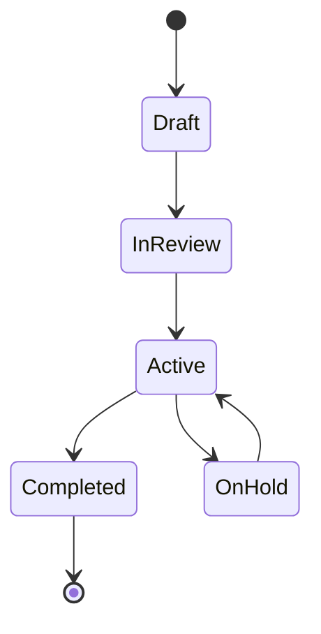

# Project Management

## Overview

ProjectHub provides comprehensive project management capabilities for educational institutions. This guide explains core concepts and workflows.

## Project Lifecycle

1. Creation
2. Planning
3. Execution
4. Monitoring
5. Closure

## Project Components

### Core Elements
- Project Details
- Team Members
- Tasks
- Resources
- Timeline
- Deliverables

## Project Roles

| Role | Responsibilities | Access Level |
|------|-----------------|--------------|
| Project Manager | Overall project management | Full |
| Team Lead | Team coordination | High |
| Developer | Implementation | Medium |
| Reviewer | Quality assurance | Medium |

## Project Workflow

## Best Practices

!!! tip "Project Management Tips"
    - Define clear objectives
    - Set realistic timelines
    - Assign clear responsibilities
    - Track progress regularly
    - Document decisions
    - Maintain communication

## Related Resources

- Task Management
- Resource Management
- Team Management
