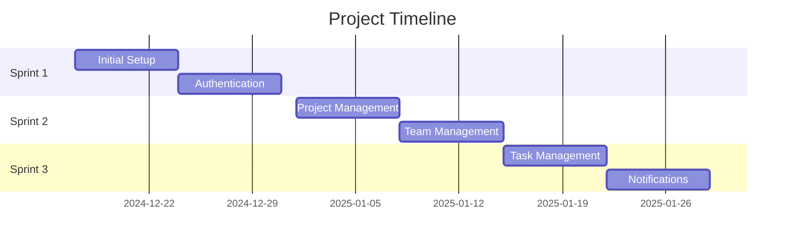

# Sprint Planning

## Overview

Project development is organized into 3 sprints, each focusing on specific features and functionalities.

## Sprint Schedule

| Sprint | Dates | Objectives | User Stories | Rules |
|--------|-------|------------|--------------|--------|
| Sprint 1 | 17/12/2024 - 31/12/2024 | - Initial setup - Authentication - Database | - Spring Boot/Security config - User CRUD - Role management | RG-013, RG-014, RG-015, RG-016 |
| Sprint 2 | 01/01/2025 - 14/01/2025 | - Project management - Team management - Evaluation criteria | - Project CRUD - Team CRUD - Evaluation setup | RG-001, RG-002, RG-003, RG-004, RG-017, RG-020, RG-021 |
| Sprint 3 | 15/01/2025 - 29/01/2025 | - Task management - Notifications - Reports | - Task CRUD - Notification system - Weekly reports | RG-005, RG-006, RG-007, RG-008, RG-026, RG-027, RG-028 |

## Progress Tracking

